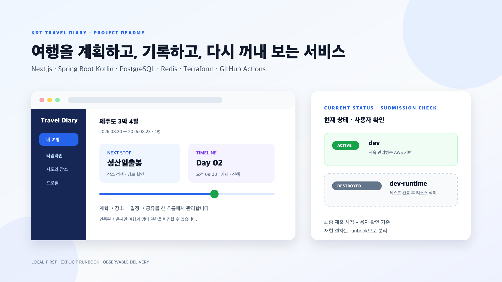
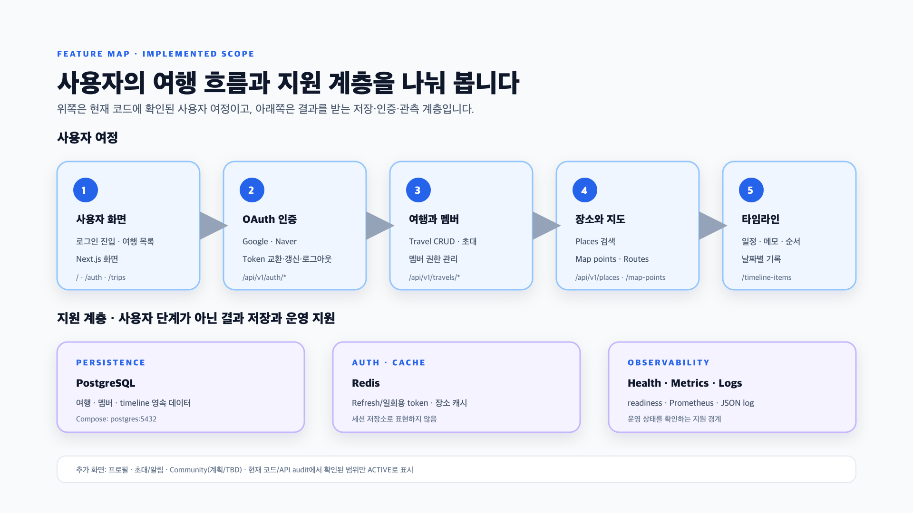
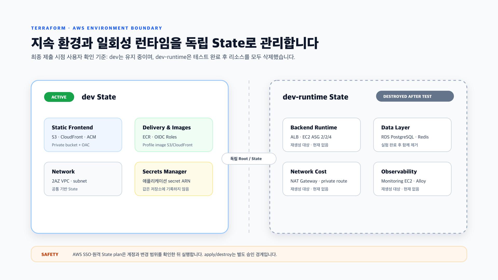
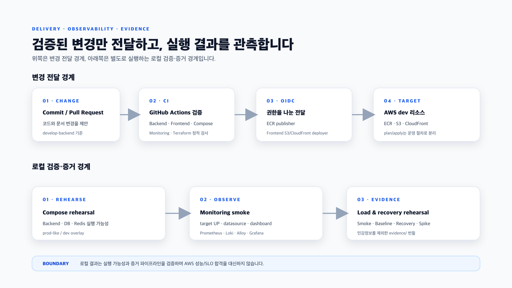

# KDT Travel Diary

여행 동행자가 여행을 만들고 초대하고, 장소와 일정을 함께 정리한 뒤 기록을 다시 꺼내 보는
Full-stack 서비스입니다. Next.js 프런트엔드와 Spring Boot Kotlin 백엔드를 Docker Compose로
재현할 수 있고, AWS 리소스는 Terraform Root와 State를 환경별로 분리해 관리합니다.



> 이 문서는 최종 제출 시점의 사용자 확인 기준으로 작성했습니다. `dev`는 유지 중인 환경이고,
> 테스트용 `dev-runtime`은 실험이 끝난 뒤 전체 삭제되었습니다. 아래 runbook은 필요할 때
> 같은 실험 환경을 재생성하기 위한 절차입니다.

## 목차

- [프로젝트 한눈에 보기](#프로젝트-한눈에-보기)
- [현재 기능](#현재-기능)
- [시스템 구성](#시스템-구성)
- [로컬 실행](#로컬-실행)
- [모니터링과 부하·복구 리허설](#모니터링과-부하복구-리허설)
- [Terraform과 AWS 환경](#terraform과-aws-환경)
- [CI/CD와 검증](#cicd와-검증)
- [제출 전 체크리스트](#제출-전-체크리스트)

## 프로젝트 한눈에 보기

### 누구를 위한 서비스인가

여행을 함께 준비하는 사용자가 OAuth로 로그인한 뒤 여행을 만들고 동행자를 초대합니다. 멤버는
장소를 검색해 지도에 남기고, 날짜별 일정·메모를 타임라인으로 관리합니다. 프로필과 초대 상태는
별도 화면에서 확인하며, 계획/TBD로 남은 Community 화면은 구현 완료 기능으로 세지 않습니다.

핵심 흐름은 `OAuth 로그인 → 여행 생성/초대 → 장소·지도 확인 → 타임라인 작성·정렬 → 공유와 기록`입니다.
이 흐름은 아래 기능 표와 실제 API 경로, 그리고 로컬 Compose 실행 경계로 이어집니다.

| 영역 | 선택 기술 | 역할 |
| --- | --- | --- |
| Frontend | Next.js 16.2, React 19, TypeScript, Tailwind CSS 4 | 로그인, 여행·타임라인 화면, 지도 UI |
| Backend | Spring Boot 3.5, Kotlin, JDK 21 | OAuth, 여행/멤버/일정 API, 권한 검증 |
| Data | PostgreSQL 17, Redis 7.4 | 여행·멤버·일정 영속화, Refresh/일회용 토큰·장소 캐시 |
| Local runtime | Docker Compose v2 | dev/prod-like 실행과 통합 검증 |
| AWS IaC | Terraform 1.10 이상 | State별 네트워크, 정적 배포, 이미지·권한 구성 |
| Delivery | GitHub Actions + OIDC | 테스트, ECR push, S3/CloudFront 배포 |
| Observability | Prometheus, Loki, Grafana, Alloy | metrics·구조화 로그·대시보드 |

로컬 Compose에서는 `frontend:3000`, `backend:8080`, `backend management:9091`을 사용합니다.
PostgreSQL과 Redis는 Compose 내부 네트워크에서만 접근하며, dev/prod-like는 서로 다른
`COMPOSE_PROJECT_NAME`과 named volume을 사용합니다.

## 현재 기능

아래 항목은 현재 백엔드 API와 프런트엔드 호출 경로를 기준으로 정리한 구현 범위입니다.

| 기능 | 제공 내용 | 대표 경로 |
| --- | --- | --- |
| OAuth 인증 | Google/Naver 로그인 시작·callback, 서비스 토큰 교환·갱신·로그아웃 | `/auth`, `/auth/callback`, `/api/v1/auth/**` |
| 여행 계획 | 여행 생성·조회·수정·삭제, 여행별 멤버 초대와 권한 관리 | `/trips`, `/api/v1/travels` |
| 장소·지도 | 국가/도시 조회, 장소 검색, 지도 point와 route 데이터 | `/api/v1/countries`, `/api/v1/places/search`, `/api/v1/travels/{travelId}/map-points` |
| 타임라인 | 날짜별 일정·메모 CRUD와 방문 순서 관리 | `/trips/detail`, `/api/v1/travels/{travelId}/timeline-items` |
| 프로필 | 프로필 조회·수정, 프로필 이미지, 계정 삭제 | `/mypage`, `/api/v1/users/me/**` |
| 알림·초대 | 받은 초대 조회·응답, 여행별 초대 생성·취소 | `/notifications`, `/api/v1/users/me/travel-invitations`, `/api/v1/travels/{travelId}/invitations`, `/api/v1/travel-invitations/{invitationId}` |
| 운영 관측 | health/readiness, Prometheus metrics, JSON application log | `9091/actuator/**` |

커뮤니티 화면은 현재 공개 여행 일정을 둘러보는 placeholder 수준으로, 이 README에서는
완성된 기능으로 주장하지 않습니다. 구현 여부가 `TBD` 또는 계획으로 남은 요구사항도 같은
원칙으로 별도 표시합니다.



이미지 원본과 동일한 시각 규칙은 [`docs/readme-assets`](docs/readme-assets/)에 있습니다.
README의 기술 다이어그램은 Mermaid 대신 추적 가능한 PNG와 편집 가능한 SVG 원본을 사용합니다.

## 시스템 구성

### 로컬 애플리케이션 경계

```text
Browser
  └─ frontend (Next.js :3000)
       └─ backend (Spring Boot :8080 / management :9091)
            ├─ postgres (PostgreSQL :5432)
            └─ redis (Redis :6379)
```

프런트엔드는 브라우저에서 사용할 `NEXT_PUBLIC_API_BASE_URL`과 Next.js 서버가 Compose
네트워크에서 사용할 `INTERNAL_API_BASE_URL`을 구분합니다. 백엔드는 소셜 로그인 뒤 발급한
서비스 토큰을 `JWT_SECRET`으로 서명하며, 실제 환경의 비밀값은 저장소에 기록하지 않습니다.

### AWS State 경계



| Root/State | 현재 의미 | 주요 범위 |
| --- | --- | --- |
| `infra/bootstrap` | State S3 최초 생성용 | S3 backend와 최소 접근 정책 |
| `infra/environments/dev` | **유지 중인 환경** | 정적 Frontend S3/CloudFront, profile image, VPC 기반, ECR, GitHub OIDC 역할, Secrets Manager |
| `infra/environments/dev-runtime` | **테스트 후 전체 삭제** | NAT, ALB, Backend EC2 ASG, RDS, Redis, Monitoring EC2 등 비용 발생 runtime |
| `infra/environments/prod` | 별도 운영 범위 | 현재는 정적 검증 위주이며 운영 적용을 주장하지 않음 |

`dev-runtime`은 `dev` State와 분리된 일회성 실험 환경입니다. 지금은 실행 중인 리소스가
없으므로 AWS runtime endpoint나 현재 비용이 발생한다고 해석하면 안 됩니다. 재생성이 필요할
때는 [`infra/environments/dev-runtime/README.md`](infra/environments/dev-runtime/README.md)의
사전 조건과 변경 allowlist를 먼저 읽습니다.

## 로컬 실행

### 사전 준비

- Docker Desktop 또는 Docker Engine
- Docker Compose v2 이상

Node.js, JDK, Gradle은 호스트에 설치하지 않아도 됩니다. 빌드와 실행은 컨테이너 내부에서
수행합니다.

### 환경 파일

실제 환경 파일은 Git에서 제외됩니다. 처음 실행할 때만 예제를 복사합니다.

```bash
cp .env.dev.example .env.dev
cp .env.prod.example .env.prod
```

예제 비밀번호는 로컬 검증 전용입니다. 실제 배포에서는 Secrets Manager 등 비밀 저장소에서
주입하고, `JWT_SECRET`과 `GRAFANA_ADMIN_PASSWORD`는 서로 다른 32바이트 이상의 값을 사용합니다.

### 개발 Compose 실행

```bash
docker compose --env-file .env.dev \
  -f compose.yml -f compose.dev.yml \
  up --build
```

- Frontend: <http://localhost:3000>
- Backend ping: <http://localhost:8080/api/ping>
- Backend health: <http://localhost:9091/actuator/health>
- Prometheus metrics endpoint: <http://localhost:9091/actuator/prometheus>

Frontend 변경은 Fast Refresh로 반영됩니다. `build.gradle.kts`나 `settings.gradle.kts`를
변경했다면 backend 이미지를 다시 빌드합니다.

```bash
docker compose --env-file .env.dev \
  -f compose.yml -f compose.dev.yml \
  up --build backend
```

종료는 named volume을 보존하는 `down`을 사용합니다.

```bash
docker compose --env-file .env.dev \
  -f compose.yml -f compose.dev.yml down
```

`down -v`는 PostgreSQL과 Redis 데이터를 복구할 수 없게 삭제하므로, 데이터 초기화가
확실할 때만 사용합니다.

### 컨테이너 접속과 데이터 백업

실행 중인 서비스의 셸이 필요하면 Alpine 이미지의 `sh`를 사용합니다.

```bash
docker compose --env-file .env.dev \
  -f compose.yml -f compose.dev.yml \
  exec backend sh
```

named volume은 백업을 대신하지 않습니다. PostgreSQL은 데이터 디렉터리를 복사하지 않고
`pg_dump`로 백업합니다.

```bash
docker compose --env-file .env.dev \
  -f compose.yml -f compose.dev.yml \
  exec -T postgres sh -c 'pg_dump -U "$POSTGRES_USER" "$POSTGRES_DB"' \
  > travel-diary-dev.sql
```

### Production-like Backend 검증

`compose.yml`은 frontend 없이 `backend`, `postgres`, `redis`만 실행합니다. 이 명령은 실제 AWS
RDS나 관리형 Redis가 아닌 runner 이미지와 로컬 데이터 컨테이너의 연결·readiness를 검증합니다.

```bash
docker compose --env-file .env.prod.example -f compose.yml config --quiet
docker compose --env-file .env.prod.example -f compose.yml build backend
docker compose --env-file .env.prod.example -f compose.yml up -d --wait postgres redis backend
curl --fail http://localhost:8080/api/ping
docker compose --env-file .env.prod.example -f compose.yml down
```

Frontend 포함 Compose 경계만 확인하려면 `.env.dev.example`과 `compose.dev.yml` overlay를 사용합니다.
이 overlay는 개발용 frontend와 backend volume을 추가하므로 위 production-like 명령과 섞지 않습니다.

```bash
docker compose --env-file .env.dev.example \
  -f compose.yml -f compose.dev.yml config --quiet
```

## 모니터링과 부하·복구 리허설

Prometheus, Loki, Alloy, Grafana는 기본 애플리케이션 실행과 분리된 opt-in overlay입니다.

```bash
./monitoring/validate-configs.sh
./monitoring/smoke-test.sh dev
./monitoring/smoke-test.sh prod
```

dev overlay를 직접 실행해 화면과 수집 경로를 확인하려면 다음 명령을 사용합니다.

```bash
docker compose --env-file .env.dev \
  -f compose.yml -f compose.dev.yml \
  -f compose.monitoring.yml -f compose.monitoring.dev.yml \
  up --build -d --wait
```

Prometheus `:9090`, Loki readiness `:3100/ready`, Alloy UI `:12345`, Grafana `:3001`이
dev에서 공개됩니다. 설정과 운영 원칙은 [`monitoring/README.md`](monitoring/README.md)에
있습니다.

Compose 리허설은 AWS ALB·ASG·RDS·관리형 Redis의 성능을 재현하지 않습니다. 로컬에서
seed → Smoke → Baseline → Recovery → Spike와 T1~T6 증거 파이프라인을 확인하는 용도입니다.

```bash
./scripts/loadtest/run-compose-rehearsal.sh all \
  --env-file .env.prod.example --users 20 --rate 8
```

자세한 사전 조건, evidence 구조, 단축 실행과 복구 판정은
[`load-tests/README.md`](load-tests/README.md)를 따릅니다. 생성된 token, Cookie, 합성 데이터와
`evidence/`는 Git에 포함하지 않습니다.

## Terraform과 AWS 환경

### 로컬 코드·CI 검증

원격 State를 초기화하지 않는 정적 검증과 module test는 누구나 재현할 수 있습니다. `fmt`는
오프라인 검사지만, `init -backend=false`는 provider/plugin을 준비해야 합니다. 이 저장소의 root
provider에는 `allowed_account_ids`가 있어 `validate` 과정에서 AWS 계정 확인이 발생할 수 있으므로,
자격증명·네트워크가 없는 환경에서 “AWS 접속이 전혀 없다”고 보장하지 않습니다.

```bash
terraform fmt -check -recursive infra
terraform -chdir=infra/bootstrap init -backend=false
terraform -chdir=infra/bootstrap validate
terraform -chdir=infra/environments/dev init -backend=false
terraform -chdir=infra/environments/dev validate
terraform -chdir=infra/environments/dev-runtime init -backend=false
terraform -chdir=infra/environments/dev-runtime validate
terraform -chdir=infra/environments/prod init -backend=false
terraform -chdir=infra/environments/prod validate
terraform -chdir=infra/modules/terraform_state_backend test
terraform -chdir=infra/modules/profile_image test
terraform -chdir=infra/modules/static_frontend test
terraform -chdir=infra/modules/github_ecr_publisher test
terraform -chdir=infra/modules/github_frontend_deployer test
```

CI도 `init -backend=false`, `validate`, `terraform test`, TFLint/Trivy 중심으로 실행하며,
원격 State를 사용한 plan/apply는 실행하지 않습니다. 로컬 root `validate`가 AWS 계정 확인에서
멈추면 자격증명 없이 성공했다고 간주하지 말고, provider 초기화가 필요한 검증으로 기록합니다.

### AWS SSO와 원격 State를 사용하는 plan

`plan` 자체는 리소스를 변경하지 않지만, AWS SSO 세션과 원격 S3 State에 접근해 실제 계정의
리소스·State를 조회합니다. 따라서 실행 전 다음 세 가지를 확인해야 합니다.

1. `aws sso login`에 사용한 Profile이 의도한 계정인지 확인합니다.
2. `aws sts get-caller-identity`의 Account가 해당 `terraform.tfvars`의 `aws_account_id`와 같은지 확인합니다.
3. `backend.hcl`의 bucket/key가 다른 환경 State를 가리키지 않는지 확인합니다.

예시(읽기·계획 확인):

```bash
aws sso login --profile kdt-travel-terraform
AWS_PROFILE=kdt-travel-terraform aws sts get-caller-identity
AWS_PROFILE=kdt-travel-terraform \
  terraform -chdir=infra/environments/dev init \
  -backend-config=backend.hcl
AWS_PROFILE=kdt-travel-terraform \
  terraform -chdir=infra/environments/dev plan \
  -var-file=terraform.tfvars -out=dev.tfplan
terraform -chdir=infra/environments/dev show dev.tfplan
```

`allowed_account_ids`가 다른 계정을 감지하면 Provider가 실행을 중단합니다. 저장된 plan,
실제 `tfvars`, backend 설정과 SSO 임시 키는 커밋하지 않습니다.

`terraform apply`는 실제 리소스를 만들거나 교체하고, `terraform destroy`는 RDS·Redis·NAT·ALB
등을 삭제해 비용과 데이터를 바꿀 수 있습니다. 이 두 명령은 저장된 plan의 변경 범위를 사람이
확인한 뒤 별도 승인하고 실행합니다. 특히 `dev-runtime` 재생성·종료는 전용 runbook의
allowlist와 정리 확인을 모두 통과해야 합니다.

### 재생성 runbook

[`infra/README.md`](infra/README.md)는 bootstrap → 원격 State → dev plan의 전체 흐름을,
[`infra/environments/dev-runtime/README.md`](infra/environments/dev-runtime/README.md)는
일회성 runtime의 사전 조건·plan 검토·관측 확인·destroy 후 잔존 리소스 확인을 설명합니다.
현재 runtime은 삭제된 상태이므로, 문서의 apply/destroy 예시는 실행 기록이 아니라 재현 절차입니다.

## CI/CD와 검증



로컬에서 PR 전 빠르게 확인할 때는 실행 중인 dev Compose의 서비스 대신 일회성 컨테이너로
lint와 Backend test를 수행할 수 있습니다.

```bash
docker compose --env-file .env.dev \
  -f compose.yml -f compose.dev.yml \
  run --rm --no-deps frontend npm run lint
docker compose --env-file .env.dev \
  -f compose.yml -f compose.dev.yml \
  run --rm --no-deps backend ./gradlew test --no-daemon
```

| Workflow | 확인 내용 |
| --- | --- |
| [`backend-test.yml`](.github/workflows/backend-test.yml) | Backend unit/integration test와 이미지 빌드 |
| [`frontend-test.yml`](.github/workflows/frontend-test.yml) | Frontend lint·build 검증 |
| [`compose-build.yml`](.github/workflows/compose-build.yml) | Compose config, backend readiness, CORS, Flyway, Redis 연결 |
| [`monitoring-verification.yml`](.github/workflows/monitoring-verification.yml) | Prometheus/Loki/Alloy/Grafana 설정·통합 smoke |
| [`terraform-verification.yml`](.github/workflows/terraform-verification.yml) | fmt, backend-less init/validate, module test, 보안 정적 검사 |
| [`backend-dev-image.yml`](.github/workflows/backend-dev-image.yml) | dev Compose overlay로 Backend development image를 빌드하고 외부 서비스 환경 키를 확인 |
| [`backend-deploy-dev.yml`](.github/workflows/backend-deploy-dev.yml) | OIDC로 ECR에 Backend image를 push하고 digest를 출력 |
| [`frontend-deploy-dev.yml`](.github/workflows/frontend-deploy-dev.yml) | 정적 산출물을 S3에 업로드하고 제한된 CloudFront invalidation |
| [`release-main-dev.yml`](.github/workflows/release-main-dev.yml) | 릴리스 브랜치의 검증·배포 조합 |

GitHub Actions는 장기 Access Key 대신 OIDC 역할을 사용하며, ECR publisher와 Frontend
deployer 권한을 분리합니다. ECR push나 S3 배포 workflow가 Terraform State, EC2/ASG, IAM을
수정하지 않는 것이 현재 권한 경계입니다.

## 제출 전 체크리스트

- [ ] `docker compose ... config --quiet`가 dev/prod-like/monitoring 조합에서 통과한다.
- [ ] Backend test, Frontend lint/build, Monitoring smoke, Terraform 정적 검증을 실행했다.
- [ ] README의 기능 표가 실제 API와 일치하고 계획/TBD 기능을 완료로 표현하지 않는다.
- [ ] `dev` 유지 상태와 `dev-runtime` 삭제 상태가 최신이다.
- [ ] AWS plan 예시의 Profile·Account·State 확인 절차를 지켰다.
- [ ] apply/destroy 전용 승인 경계와 runbook allowlist를 확인했다.
- [ ] README 이미지 4종이 동일한 16:9 시각 규칙을 사용하고 SVG 원본이 함께 있다.
- [ ] 실제 `.env`, Terraform State/plan, token·Cookie·evidence가 변경에 포함되지 않는다.

문서 범위의 진행 상황과 완료 조건은 [Issue #334](https://github.com/protove/KDT_TravelPlanner/issues/334)에서 추적합니다.
