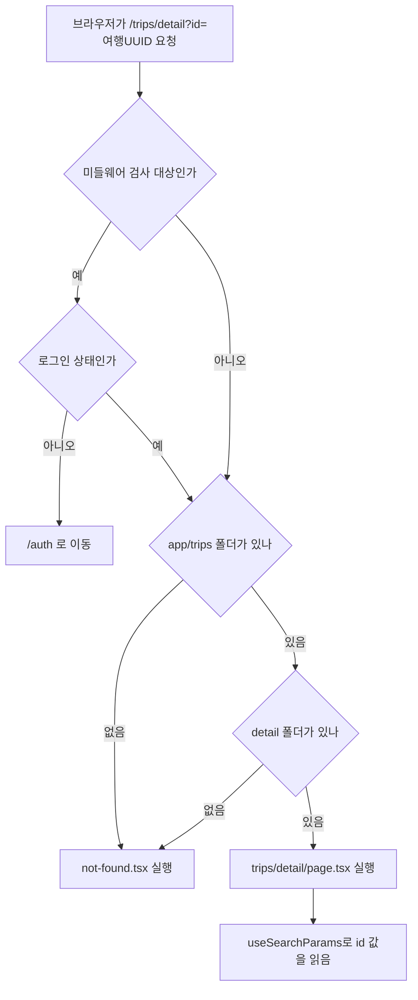
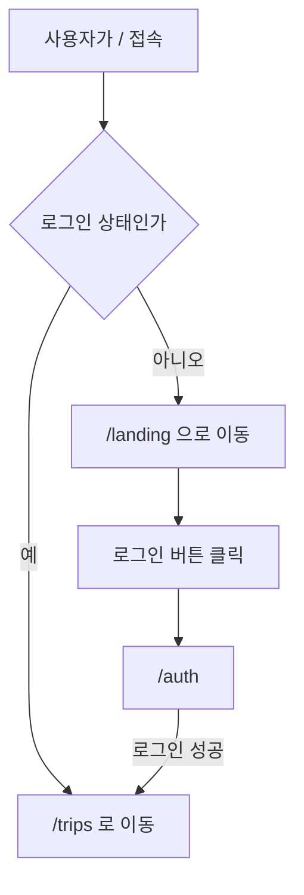
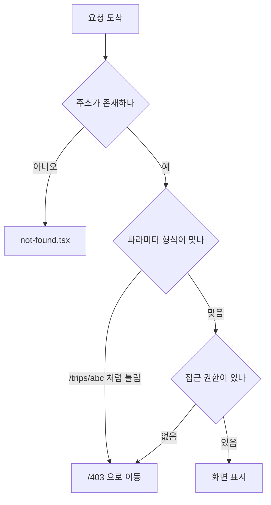
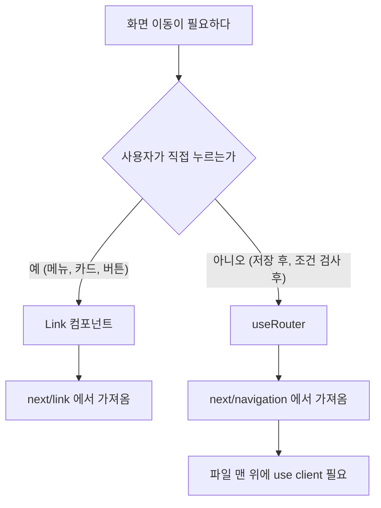

# Next.js 라우팅 규칙

App Router가 어떤 규칙으로 동작하는지, 우리 프로젝트에 어떻게 적용했는지, 새 화면을 추가할 때 무엇을 하면 되는지 정리한 문서입니다.

디자인 토큰과 컴포넌트 규칙은 `docs/front.md`, 로컬 실행 방법은 저장소 루트의 `README.md`를 참고하세요.

## 1. 폴더가 곧 주소가 된다

App Router는 별도 설정 파일이나 라우팅 라이브러리 없이 `src/app` 아래 폴더 구조를 그대로 주소로 사용합니다.

```
src/app/trips/page.tsx        →  /trips
src/app/mypage/page.tsx       →  /mypage
src/app/trips/detail/page.tsx →  /trips/detail?id=<여행 UUID>
```

React 단독 프로젝트에서 쓰는 `react-router-dom`은 설치하지 않습니다. 라우팅이 이미 내장되어 있어 중복이며 서버 컴포넌트와 충돌합니다.

## 2. 요청이 들어오면 어떤 파일이 실행되는가



미들웨어가 먼저 실행되고 그다음 폴더를 찾습니다. 여행 상세는 CloudFront 정적 전환을 위해 고정 경로인 `/trips/detail`을 사용하고, 여행 ID는 `?id=...` 쿼리스트링으로 전달합니다.

## 3. 이름이 정해져 있는 파일들

App Router에는 Next.js가 미리 정해둔 파일명이 있습니다. 예약어처럼 취급되며 다른 이름으로 바꾸면 동작하지 않습니다.

| 파일명 | 역할 | 필수 여부 |
| --- | --- | --- |
| `page.tsx` | 그 주소에 보여줄 화면 | 이 파일이 있어야 주소가 생김 |
| `layout.tsx` | 여러 페이지가 공유하는 껍데기 | `app/layout.tsx`는 필수 |
| `not-found.tsx` | 없는 주소로 들어왔을 때 | 선택 |
| `error.tsx` | 오류가 났을 때 | 선택 |
| `loading.tsx` | 불러오는 중일 때 | 선택 |
| `middleware.ts` | 페이지에 닿기 전에 요청을 가로챔 | 선택 |

`middleware.ts`는 반드시 `src/middleware.ts`에 있어야 하며 다른 위치에 두면 실행되지 않습니다.

파일명만으로는 역할을 알기 어렵기 때문에 폴더명으로 구분합니다. `trips/page.tsx`는 여행 목록, `mypage/page.tsx`는 마이페이지가 됩니다.

## 4. 우리 프로젝트 구조

```
src/
├── middleware.ts           로그인 여부 판단 후 이동 처리
├── app/
│   ├── layout.tsx          전체 공통 껍데기
│   ├── page.tsx            미들웨어가 가로채므로 직접 열리지 않음
│   ├── not-found.tsx       없는 주소
│   ├── landing/            /landing         서비스 소개
│   ├── auth/               /auth            로그인
│   ├── trips/
│   │   ├── page.tsx        /trips           여행 목록
│   │   └── detail/page.tsx /trips/detail?id=<UUID> 여행 상세
│   ├── mypage/             /mypage
│   ├── community/          /community       공개된 여행 일정
│   ├── notifications/      /notifications
│   └── 403/                /403             접근 불가 안내
├── components/             화면 조각 (atoms · molecules · organisms · templates)
└── lib/
    └── stores/             전역 상태 (zustand)
```

도메인 단위로 나눠서 어떤 기능을 어느 폴더에서 구현할지 바로 알 수 있게 했습니다.

## 5. 새 페이지 추가하기

### 5.1 절차

여행 일정을 수정하는 `/trips/1/edit` 화면을 만든다고 가정합니다.

폴더와 파일을 만듭니다.

```bash
mkdir -p "src/app/trips/[id]/edit"
```

`src/app/trips/[id]/edit/page.tsx`를 만들고 컴포넌트를 기본 내보내기로 작성합니다.

```tsx
"use client";

import { useParams } from "next/navigation";

export default function TripEditPage() {
  const { id } = useParams<{ id: string }>();

  return <div>여행 {id} 수정</div>;
}
```

브라우저에서 `http://localhost:3000/trips/1/edit`으로 확인합니다. 서버를 다시 켤 필요 없이 새로고침하면 반영됩니다.

### 5.2 로그인이 필요한 화면이라면

이미 보호 중인 도메인 아래에 만드는 화면이라면 추가 작업이 없습니다. `/trips/:path*`는 `/trips` 아래 모든 주소를 뜻하므로 `/trips/1/edit`은 자동으로 포함됩니다.

새 도메인을 만들 때는 `src/middleware.ts` 두 곳을 모두 수정해야 합니다. 한 곳만 고치면 동작하지 않습니다.

```ts
const PROTECTED = ["/trips", "/mypage", "/notifications", "/community"];

export const config = {
  matcher: [
    "/",
    "/auth",
    "/landing",
    "/trips/:path*",
    "/mypage/:path*",
    "/notifications/:path*",
    "/community/:path*",
  ],
};
```

`matcher`는 미들웨어를 실행할 대상을 정하고, `PROTECTED`는 그중 로그인이 필요한 경로를 정합니다. `matcher`에 없으면 미들웨어 자체가 실행되지 않습니다.

### 5.3 확인 사항

- 폴더 안에 `page.tsx`가 있는지
- 로그인이 필요하면 미들웨어에 경로가 있는지
- 그 화면에서만 쓰는 컴포넌트는 `_components/`에 두었는지

## 6. 화면 분기 규칙



주소를 바꿔서 보내는 방식을 택했습니다. 파일 하나가 화면 하나만 책임지고, 링크를 공유하면 받는 사람도 같은 화면으로 들어옵니다.

한 페이지에서 조건에 따라 다른 내용을 그리는 방식도 가능하지만, 그렇게 하면 `/`가 랜딩과 여행 목록을 동시에 책임지게 되어 파일이 커집니다.

### 6.1 미들웨어 전체 코드

```ts
import { NextResponse, type NextRequest } from "next/server";

const PROTECTED = ["/trips", "/mypage", "/notifications", "/community"];
const GUEST_ONLY = ["/auth", "/landing"];

export function middleware(request: NextRequest) {
  const { pathname } = request.nextUrl;
  const loggedIn = request.cookies.get("logged_in")?.value === "1";

  if (pathname === "/") {
    return NextResponse.redirect(
      new URL(loggedIn ? "/trips" : "/landing", request.url),
    );
  }

  if (!loggedIn && PROTECTED.some((p) => pathname.startsWith(p))) {
    const url = new URL("/auth", request.url);
    url.searchParams.set("redirect", pathname);
    return NextResponse.redirect(url);
  }

  if (loggedIn && GUEST_ONLY.some((p) => pathname.startsWith(p))) {
    return NextResponse.redirect(new URL("/trips", request.url));
  }

  return NextResponse.next();
}

export const config = {
  matcher: [
    "/",
    "/auth",
    "/landing",
    "/trips/:path*",
    "/mypage/:path*",
    "/notifications/:path*",
    "/community/:path*",
  ],
};
```

`matcher`에 적힌 경로에서만 미들웨어가 실행됩니다. 모든 요청에서 실행하면 이미지나 정적 파일 요청까지 검사하게 되어 불필요합니다.

이미 로그인한 사용자가 `/auth`나 `/landing`으로 들어오면 `/trips`로 보냅니다. 로그인한 상태에서 로그인 화면이 다시 보이지 않도록 하기 위한 처리입니다.

### 6.2 원래 가려던 주소로 돌아가기

비로그인 상태로 `/trips/1`에 접근하면 주소에 목적지를 남깁니다.

```
/auth?redirect=/trips/1
```

로그인에 성공하면 그 값을 읽어 되돌려보냅니다.

```tsx
const searchParams = useSearchParams();

const redirect = searchParams.get("redirect");
router.push(redirect?.startsWith("/") ? redirect : "/trips");
```

`startsWith("/")` 검사는 외부 주소가 들어오는 것을 막기 위한 것입니다. 이 검사가 없으면 `/auth?redirect=https://악성사이트`로 사용자를 보낼 수 있습니다.

## 7. 로그인 상태는 어떻게 유지되는가

세 가지가 함께 동작합니다.

| 위치 | 저장 내용 | 읽는 곳 |
| --- | --- | --- |
| `logged_in` 쿠키 | 로그인 여부 표시 | 미들웨어 (서버) |
| zustand 스토어 | 사용자 정보 | 화면 (브라우저) |
| localStorage | 새로고침 대비 백업 | zustand persist가 자동 처리 |

로그인하면 스토어에 사용자 정보를 넣고 동시에 쿠키를 심습니다.

```ts
login: (provider) => {
  document.cookie = "logged_in=1; path=/; max-age=86400";
  set({ isLoggedIn: true, user: MOCK_USER_BY_PROVIDER[provider] });
},
```

쿠키가 필요한 이유는 미들웨어가 서버에서 실행되기 때문입니다. zustand 상태는 브라우저 안에만 있어서 서버가 읽을 수 없습니다.

`path=/`로 지정해야 모든 페이지 요청에 쿠키가 실립니다. 특정 경로로 제한하면 그 경로 요청에만 실려서 미들웨어가 읽지 못합니다.

이 쿠키는 화면 이동을 위한 표시이며 보안 장치가 아닙니다. 브라우저에서 임의로 만들 수 있으므로 실제 권한 검사는 API 호출 시 백엔드가 수행합니다.

## 8. 잘못된 요청 처리



여행 id는 숫자여야 하므로 `/trips/abc` 같은 요청은 403으로 보냅니다.

```tsx
const { id } = useParams<{ id: string }>();

React.useEffect(() => {
  if (id && !/^\d+$/.test(id)) router.replace("/403");
}, [id, router]);
```

`not-found.tsx`와 `/403`은 같은 안내 문구를 보여줍니다. 사용자 입장에서는 주소가 틀렸든 권한이 없든 들어갈 수 없다는 사실만 알면 되기 때문입니다.

흐름도의 권한 검사 단계는 아직 연결되지 않았습니다. 인증 작업이 끝난 뒤 API 응답을 받아 처리할 예정이며, 현재 동작하는 것은 주소와 파라미터 검사입니다.

## 9. 화면을 이동시키는 방법



링크로 이동할 때는 `Link`를 씁니다.

```tsx
import Link from "next/link";

<Link href="/trips">내 여행</Link>
<Link href={`/trips/detail?id=${encodeURIComponent(trip.id)}`}>{trip.title}</Link>
```

`<a>` 태그를 쓰면 페이지 전체가 새로고침되어 화면이 깜빡이고 상태가 사라집니다.

코드로 이동할 때는 `useRouter`를 씁니다.

```tsx
"use client";
import { useRouter } from "next/navigation";

const router = useRouter();
router.push("/trips");      // 뒤로가기 가능
router.replace("/auth");    // 뒤로가기 막고 이동
```

로그인 화면처럼 뒤로가기로 돌아가면 안 되는 경우에는 `replace`를 씁니다.

import 경로는 `next/router`가 아니라 `next/navigation`입니다.

### 9.1 현재 연결된 이동

| 클릭 대상 | 이동 위치 | 연결된 곳 |
| --- | --- | --- |
| 헤더 로고 (로그인 화면) | `/trips` | `AppHeader` `onLogoClick` |
| 헤더 로고 (랜딩) | `/landing` | `AppHeader` `onLogoClick` |
| 헤더 프로필 아이콘 | `/mypage` | `AppHeader` `onProfileClick` |
| 헤더 종 아이콘 | `/notifications` | `AppHeader` `onNotificationClick` |
| 여행 카드 | `/trips/detail?id=<UUID>` | `trips/page.tsx` |
| 랜딩 로그인 버튼 | `/auth` | `AppHeader` `onLoginClick` |
| 상세 화면 목록 버튼 | `/trips` | `trips/detail/page.tsx` |

랜딩 화면의 로고만 `/landing`을 가리킵니다. 비로그인 화면이라 `/trips`로 보내면 미들웨어가 다시 `/auth`로 되돌려보내기 때문입니다.

`AppHeader`는 이동 함수를 직접 갖지 않고 props로 받습니다. 같은 헤더를 여러 화면에서 쓰면서 목적지만 다르게 지정하기 위해서입니다.

## 10. 동적 라우트에서 값 꺼내기

파일 맨 위에 `"use client"`가 있는지에 따라 방법이 다릅니다.

클라이언트 컴포넌트일 때

```tsx
"use client";
import { useParams } from "next/navigation";

const { id } = useParams<{ id: string }>();
```

서버 컴포넌트일 때

```tsx
export default async function Page({
  params,
}: {
  params: Promise<{ id: string }>;
}) {
  const { id } = await params;
}
```

우리 프로젝트의 화면은 대부분 클라이언트 컴포넌트입니다. zustand 상태와 이벤트 핸들러를 쓰기 때문입니다.

여러 값을 받을 때는 폴더를 중첩합니다.

```
src/app/trips/[id]/days/[dayId]/page.tsx   →   /trips/1/days/3
```

```tsx
const { id, dayId } = useParams<{ id: string; dayId: string }>();
```

## 11. 컴포넌트를 어디에 둘 것인가

현재 모든 컴포넌트는 `src/components` 아래 Atomic 기준으로 관리합니다.

```
src/components/
├── atoms/        Button, Input, Avatar 등 최소 단위
├── molecules/    SearchBar, FormField 등 atoms 조합
├── organisms/    AppHeader, TripList 등 화면 단위 블록
└── templates/    ListLayout, DetailLayout 등 화면 골격
```

`src/app` 아래에는 `page.tsx`만 두고 화면을 그리는 조각은 위 폴더에서 가져다 씁니다. 컴포넌트 작성 규칙은 `docs/front.md`를 따릅니다.

한 화면에서만 쓰이고 다른 곳에서 재사용할 일이 없는 컴포넌트가 생기면 그 화면 폴더 안에 `_components/`를 만들어 둘 수 있습니다. 밑줄로 시작하는 폴더는 라우팅에서 제외되어 주소가 생기지 않습니다. 밑줄을 빼면 `/trips/components` 같은 주소가 만들어집니다.

현재는 해당하는 사례가 없어 사용하지 않고 있습니다.

## 12. 확인 방법

개발 환경을 띄운 뒤 아래 주소들이 예상대로 동작하는지 확인합니다.

```bash
docker compose --env-file .env.dev -f compose.yml -f compose.dev.yml up -d
```

| 확인 항목 | 기대 결과 |
| --- | --- |
| 로그아웃 상태로 `/` | `/landing`으로 이동 |
| 로그인 상태로 `/` | `/trips`로 이동 |
| 로그아웃 상태로 `/trips/1` | `/auth?redirect=/trips/1`로 이동 |
| 위 상태에서 로그인 | `/trips/1`로 복귀 |
| 로그인 후 새로고침 | 로그인 상태 유지 |
| `/trips/abc` | 403 안내 화면 |
| 로그아웃 상태로 `/community` | `/auth?redirect=/community`로 이동 |
| 로그인 상태로 `/auth` | `/trips`로 이동 |
| 로그인 상태로 `/landing` | `/trips`로 이동 |
| `/asdfasdf` | 없는 주소 안내 화면 |

## 13. 문제가 생겼을 때

| 증상 | 원인과 해결 |
| --- | --- |
| 주소로 들어가면 404 | 폴더 안에 `page.tsx`가 없음 |
| `useRouter is not a function` | `next/router`에서 import함. `next/navigation`으로 변경 |
| 훅 사용 시 오류 | 파일 맨 위 `"use client"` 누락 |
| 클릭하면 화면 전체가 깜빡임 | `<Link>` 대신 `<a>` 사용 |
| `params`가 undefined | 서버 컴포넌트에서 `await params` 누락 |
| 미들웨어가 동작하지 않음 | 파일 위치가 `src/middleware.ts`가 아니거나 `matcher`에 경로가 없음 |
| 로그인했는데 계속 로그인 화면으로 감 | 쿠키의 `path`가 `/`가 아님 |
| `Module not found` | pull 이후 의존성이 늘어남. 이미지 재빌드 필요 |

이미지 재빌드는 다음과 같이 합니다.

```bash
docker compose --env-file .env.dev -f compose.yml -f compose.dev.yml up --build -d
```
