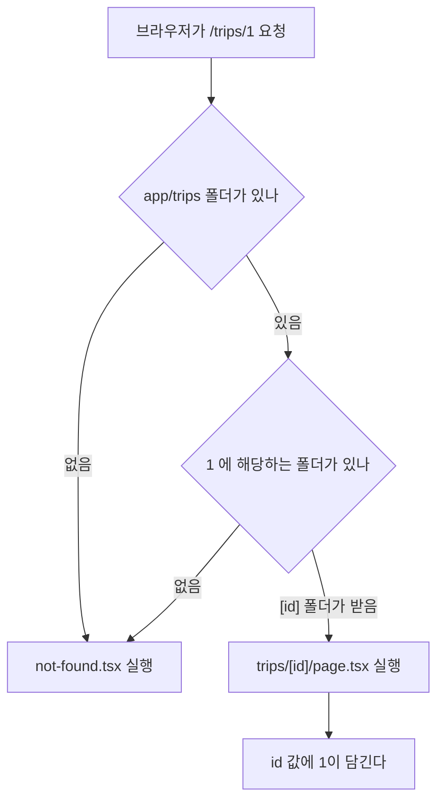
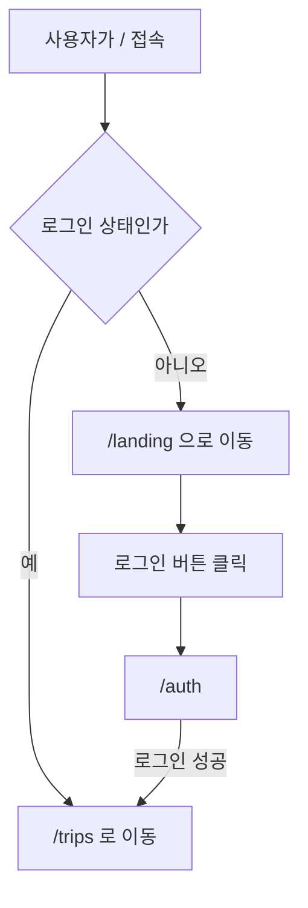
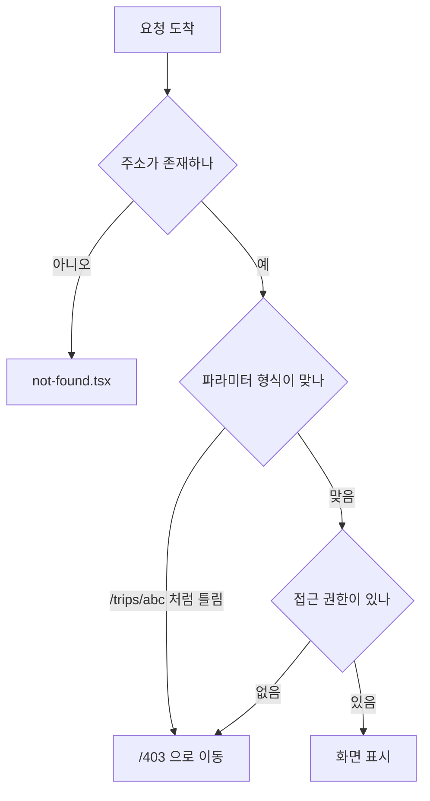
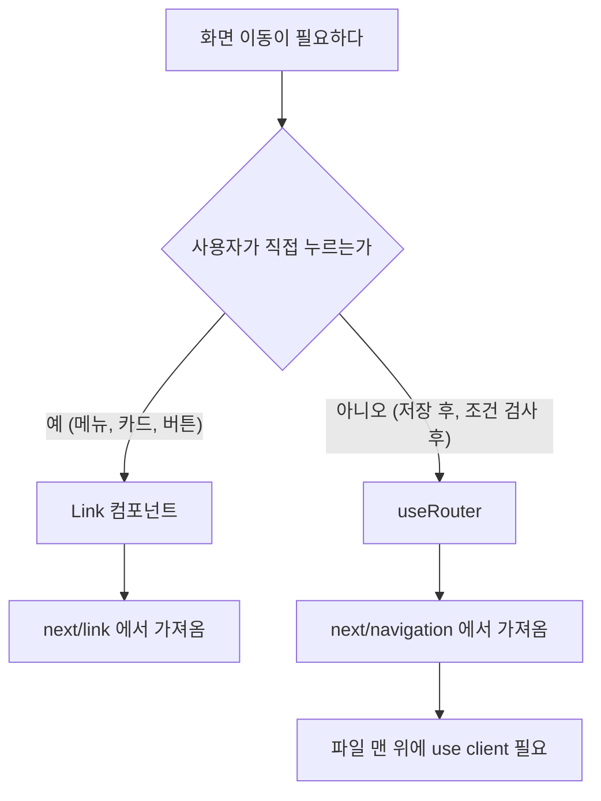

# Next.js 라우팅 규칙

App Router가 어떤 규칙으로 동작하는지와 우리 프로젝트에 어떻게 적용했는지 정리한 문서입니다.

## 1. 폴더가 곧 주소가 된다

Next.js App Router는 별도 설정 파일이나 라우팅 라이브러리 없이 `src/app` 아래 폴더 구조를 그대로 주소로 사용합니다. React 단독 프로젝트에서 쓰는 `react-router-dom`은 설치하지 않습니다.

```
src/app/trips/page.tsx        →  /trips
src/app/mypage/page.tsx       →  /mypage
src/app/trips/[id]/page.tsx   →  /trips/1
```

주소를 하나 늘리고 싶으면 폴더를 만들고 그 안에 `page.tsx`를 넣으면 됩니다.

## 2. 요청이 들어오면 어떤 파일이 실행되는가



`[id]`처럼 대괄호를 쓴 폴더는 어떤 값이 와도 받아냅니다. `/trips/1`과 `/trips/42`를 파일 하나가 처리합니다.

## 3. 이름이 정해져 있는 파일들

App Router에는 Next.js가 미리 정해둔 파일명이 있습니다. 예약어처럼 취급되며 다른 이름으로 바꾸면 동작하지 않습니다.

| 파일명 | 역할 | 필수 여부 |
| --- | --- | --- |
| `page.tsx` | 그 주소에 보여줄 화면 | 이 파일이 있어야 주소가 생김 |
| `layout.tsx` | 여러 페이지가 공유하는 껍데기 | `app/layout.tsx`는 필수 |
| `not-found.tsx` | 없는 주소로 들어왔을 때 | 선택 |
| `error.tsx` | 오류가 났을 때 | 선택 |
| `loading.tsx` | 불러오는 중일 때 | 선택 |
| `middleware.ts` | 페이지에 닿기 전에 요청을 가로챔 | 선택 |

`middleware.ts`는 우리 프로젝트에서 로그인 여부에 따라 화면을 나누는 데 사용합니다. 위치는 `src/middleware.ts` 한 곳이며 이 이름이어야 Next.js가 인식합니다.

파일명만 봐서는 역할을 알기 어렵기 때문에 폴더명으로 구분합니다. `trips/page.tsx`는 여행 목록, `mypage/page.tsx`는 마이페이지가 됩니다.

## 4. 우리 프로젝트 구조

```
src/
├── middleware.ts           로그인 여부 판단 후 이동 처리
└── app/
    ├── layout.tsx          전체 공통 껍데기
    ├── page.tsx            미들웨어가 가로채므로 직접 열리지 않음
    ├── not-found.tsx       없는 주소
    ├── landing/            /landing         서비스 소개
    ├── auth/               /auth            로그인
    ├── trips/
    │   ├── page.tsx        /trips           여행 목록
    │   └── [id]/page.tsx   /trips/1         여행 상세
    ├── mypage/             /mypage
    ├── notifications/      /notifications
    └── 403/                /403             접근 불가 안내
```

도메인 단위로 나눠서 어떤 기능을 어느 폴더에서 구현할지 바로 알 수 있게 했습니다.

## 5. 화면 분기 규칙



주소를 바꿔서 보내는 방식을 택했습니다. 파일 하나가 화면 하나만 책임지고, 링크를 공유하면 받는 사람도 같은 화면으로 들어옵니다.

판단은 `src/middleware.ts`에서 합니다. 페이지가 그려지기 전에 실행되므로 화면이 잠깐 보였다 바뀌는 일이 없습니다.

```ts
const loggedIn = request.cookies.get("logged_in")?.value === "1";

if (pathname === "/") {
  return NextResponse.redirect(
    new URL(loggedIn ? "/trips" : "/landing", request.url),
  );
}
```

`/trips`, `/mypage`, `/notifications`는 로그인이 필요합니다. 비로그인 상태로 접근하면 `/auth`로 보내면서 원래 가려던 주소를 함께 남깁니다.

```
/auth?redirect=/trips/1
```

이 쿠키는 화면 이동을 위한 표시이며 보안 장치가 아닙니다. 실제 권한 검사는 API 호출 시 백엔드가 수행합니다.

## 6. 잘못된 요청 처리



여행 id는 숫자여야 하므로 `/trips/abc` 같은 요청은 403으로 보냅니다.

없는 주소를 처리하는 `not-found.tsx`와 `/403`은 같은 안내 문구를 보여줍니다. 사용자 입장에서는 주소가 틀렸든 권한이 없든 들어갈 수 없다는 사실만 알면 되기 때문입니다.

흐름도의 권한 검사 단계는 아직 연결되지 않았습니다. 인증 작업이 끝난 뒤 API 응답을 받아 처리할 예정이며, 현재 동작하는 것은 주소와 파라미터 검사입니다.

```tsx
const { id } = useParams<{ id: string }>();

React.useEffect(() => {
  if (id && !/^\d+$/.test(id)) router.replace("/403");
}, [id, router]);
```

## 7. 화면을 이동시키는 방법



링크로 이동할 때는 `Link`를 씁니다.

```tsx
import Link from "next/link";

<Link href="/trips">내 여행</Link>
<Link href={`/trips/${trip.id}`}>{trip.title}</Link>
```

`<a>` 태그를 쓰면 페이지 전체가 새로고침되므로 사용하지 않습니다.

코드로 이동할 때는 `useRouter`를 씁니다.

```tsx
"use client";
import { useRouter } from "next/navigation";

const router = useRouter();
router.push("/trips");      // 뒤로가기 가능
router.replace("/auth");    // 뒤로가기 막고 이동
```

import 경로는 `next/router`가 아니라 `next/navigation`입니다.

### 현재 연결된 이동

| 클릭 대상 | 이동 위치 |
| --- | --- |
| 헤더 로고 | `/trips` |
| 헤더 프로필 아이콘 | `/mypage` |
| 헤더 종 아이콘 | `/notifications` |
| 여행 카드 | `/trips/[id]` |
| 랜딩 로그인 버튼 | `/auth` |
| 상세 화면 목록 버튼 | `/trips` |

헤더 이동은 `AppHeader`의 `onLogoClick`, `onProfileClick`, `onNotificationClick`에 연결되어 있습니다.

## 8. 동적 라우트에서 값 꺼내기

주소에 들어있는 값을 꺼내는 방법이 두 가지입니다. 파일 맨 위에 `"use client"`가 있는지에 따라 다릅니다.

클라이언트 컴포넌트일 때

```tsx
"use client";
import { useParams } from "next/navigation";

const { id } = useParams<{ id: string }>();
```

서버 컴포넌트일 때

```tsx
export default async function Page({
  params,
}: {
  params: Promise<{ id: string }>;
}) {
  const { id } = await params;
}
```

## 9. 주의

| 증상 | 원인 |
| --- | --- |
| 주소로 들어가면 404 | 폴더 안에 `page.tsx`가 없음 |
| `useRouter is not a function` | `next/router`에서 import함. `next/navigation`으로 변경 |
| 훅 사용 시 오류 | 파일 맨 위 `"use client"` 누락 |
| 클릭하면 화면 전체가 깜빡임 | `<Link>` 대신 `<a>` 사용 |
| `params`가 undefined | `await params` 누락 |
