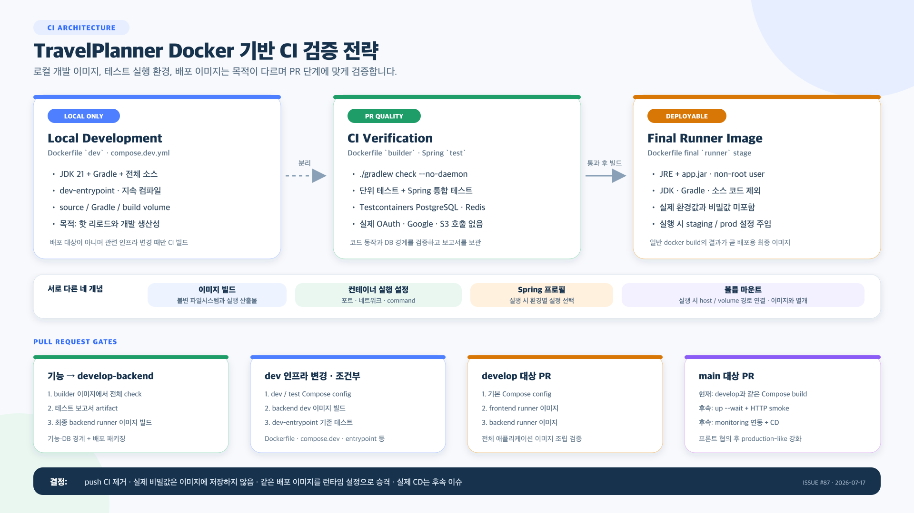

# Docker 기반 CI 검증 전략

> 상태: 팀 적용안
>
> 관련 이슈: [#87 Docker 기반 PR 검증 게이트와 설계 문서 정비](https://github.com/protove/KDT_TravelPlanner/issues/87)
>
> 적용 범위: 백엔드 기능 PR, 로컬 개발 인프라 변경 PR, `develop`·`main` 대상 통합 PR



편집 가능한 원본은 [`docker-ci-verification-strategy.svg`](./docker-ci-verification-strategy.svg)에서 확인할 수 있다.

## 1. 문서 목적

이 문서는 다음 네 개념을 분리해 TravelPlanner의 Docker 기반 CI 기준을 설명한다.

- **Docker 이미지 빌드**: 파일시스템과 실행 바이너리를 포함하는 불변 산출물을 만든다.
- **컨테이너 실행 설정**: 이미지에 환경변수, 포트, 네트워크, 볼륨을 붙여 프로세스를 실행한다.
- **Spring 프로필**: 동일한 애플리케이션에서 실행 환경별 설정을 선택한다.
- **볼륨 마운트**: 컨테이너 실행 시 호스트 경로나 Docker volume을 특정 경로에 연결한다.

이 네 가지는 서로 관련되어 있지만 같은 개념이 아니다. 특히 볼륨과 Spring 프로필은 Docker 이미지에 포함되는 것이 아니라 컨테이너를 실행할 때 적용된다.

이번 CI 개편의 목표는 다음과 같다.

1. GitHub Actions Runner에 JDK와 Gradle을 별도로 설치하지 않고 프로젝트 Dockerfile을 사용한다.
2. 백엔드 코드의 단위·통합 테스트와 배포 이미지 패키징을 서로 다른 실패 경계로 검증한다.
3. 로컬 개발 전용 이미지 검증은 관련 인프라가 변경될 때만 수행한다.
4. `develop`과 `main` 대상 PR에서는 프론트엔드와 백엔드 최종 이미지가 함께 빌드되는지 검증한다.
5. 실제 배포와 production-like 전체 스택 기동 검증은 후속 단계로 남긴다.

## 2. 현재 Dockerfile 스테이지

`backend/Dockerfile`은 하나의 파일 안에서 목적이 다른 네 스테이지를 정의한다.

| 스테이지 | 기반 | 포함 내용 | 목적 |
|---|---|---|---|
| `base` | `eclipse-temurin:21-jdk-alpine` | JDK 21, Gradle Wrapper, 빌드 설정 | 공통 빌드 도구 기반 |
| `dev` | `base` | 전체 소스, `dev-entrypoint.sh` | 로컬 핫 리로드 개발 |
| `builder` | `base` | 전체 `src`, `bootJar` 결과, Gradle 빌드 도구 | 컴파일·테스트·JAR 생성 |
| `runner` | JRE 이미지 | `app.jar`만 복사, non-root `spring` 사용자 | 배포 가능한 최종 이미지 |

`runner`가 Dockerfile의 마지막 스테이지이므로 다음 두 명령은 현재 Dockerfile에서 같은 최종 이미지를 만든다.

```bash
docker build ./backend
docker build --target runner ./backend
```

CI에서는 불필요한 용어 혼동을 줄이기 위해 최종 이미지 빌드에 일반 `docker build`를 사용한다. `runner`는 production 이미지와 다른 별도 이미지가 아니라 production 배포에 사용할 최종 스테이지다.

멀티 스테이지 빌드는 JDK·Gradle과 소스 코드를 최종 이미지에서 제외한다. 그 결과 이미지 크기와 불필요한 실행 도구가 줄고, 애플리케이션은 JRE와 JAR만 가진 non-root 컨테이너로 실행된다.

## 3. Compose 파일의 역할

### 3.1 기본 Compose

`compose.yml`은 production-like 기본 구성을 정의한다.

- backend와 frontend는 각각 Dockerfile의 `runner` 타깃을 빌드한다.
- PostgreSQL과 Redis는 같은 Compose 네트워크에 배치된다.
- backend에는 데이터베이스·Redis 주소와 Spring 프로필이 환경변수로 전달된다.
- backend 로그는 `backend_logs` volume에 저장된다.
- 소스 코드는 컨테이너에 마운트하지 않는다.

### 3.2 로컬 개발 오버레이

`compose.dev.yml`은 기본 Compose 위에 로컬 개발 편의 설정을 덮어쓴다.

- backend 빌드 타깃을 `runner`에서 `dev`로 변경한다.
- `./backend:/app` 소스 bind mount를 추가한다.
- Gradle 캐시와 build 디렉터리를 Docker volume으로 분리한다.
- `dev-entrypoint.sh`가 지속 컴파일과 Spring Boot 개발 실행을 담당한다.
- frontend도 dev 타깃과 소스 마운트를 사용한다.

따라서 현재 프로젝트의 `dev`는 배포 환경 이름이라기보다 **로컬 개발 도구 이미지**에 가깝다. JDK·Gradle과 핫 리로드가 필요하므로 최종 `runner` 이미지와 다른 것이 정상이다.

### 3.3 테스트 오버레이

`compose.test.yml`은 로컬에서 Docker 기반 테스트를 실행하기 위한 오버레이다.

- backend에 `SPRING_PROFILES_ACTIVE=test`를 전달한다.
- Testcontainers가 호스트 Docker를 사용할 수 있도록 Docker socket을 마운트한다.
- Gradle 캐시와 테스트 build 결과를 별도 volume에 저장한다.

CI에서는 테스트 보고서를 안정적으로 회수하기 위해 `builder` 이미지를 직접 실행한다. `compose.test.yml`은 로컬 표준 테스트 환경으로 유지하고, 파일이 변경되면 구문과 이미지 구성을 조건부로 검증한다.

## 4. 환경 중립적인 최종 이미지의 의미

환경 중립적이라는 표현은 로컬 `dev` 이미지와 `runner` 이미지가 같다는 뜻이 아니다.

정확한 의미는 다음과 같다.

- 로컬 개발은 개발 도구가 포함된 별도 `dev` 이미지를 사용할 수 있다.
- 배포 후보인 `runner` 이미지에는 실제 DB 주소, Redis 비밀번호, JWT 비밀값을 넣지 않는다.
- staging과 production은 동일한 `runner` 이미지에 서로 다른 런타임 설정을 주입한다.
- `SPRING_PROFILES_ACTIVE=prod`도 이미지를 빌드할 때가 아니라 컨테이너를 실행할 때 전달한다.

Spring Boot는 환경변수, 외부 설정 파일, 명령행 인자 등으로 동일 애플리케이션의 설정을 외부화할 수 있다. 이 구조를 사용하면 환경마다 소스를 다시 빌드해 서로 다른 바이너리를 만드는 대신, 검증된 하나의 배포 이미지를 승격할 수 있다.

## 5. `develop-backend` PR 검증

일반 백엔드 기능 PR은 dev와 prod 환경을 각각 실행하지 않는다. 다음 두 실패 경계를 검증한다.

### 5.1 단위·통합 테스트

먼저 `builder` 스테이지를 이미지로 만든다.

```bash
docker build \
  --target builder \
  --tag travel-planner-backend-builder:ci \
  ./backend
```

그 이미지에서 전체 Gradle 검증을 실행한다.

```bash
docker run --name travel-planner-backend-test \
  --add-host host.docker.internal:host-gateway \
  --env SPRING_PROFILES_ACTIVE=test \
  --env TESTCONTAINERS_HOST_OVERRIDE=host.docker.internal \
  --volume /var/run/docker.sock:/var/run/docker.sock \
  --volume "$(pwd)/backend/docker:/app/docker:ro" \
  travel-planner-backend-builder:ci \
  ./gradlew check --no-daemon
```

`check`는 다음을 포함한다.

- Spring 없이 실행되는 도메인·서비스 단위 테스트
- Spring Context와 MockMvc 통합 테스트
- PostgreSQL·Redis Testcontainers 통합 테스트
- Flyway migration 검증
- 외부 서비스 fake·mock 경계 테스트

실제 OAuth, Google, S3 자격 증명은 사용하지 않는다.
`builder` 스테이지에는 애플리케이션 `src`만 복사되므로, `DevEntrypointTest`가 읽는 `backend/docker` 디렉터리는 테스트 컨테이너에 read-only로 마운트한다.

### 5.2 최종 이미지 빌드

테스트가 통과하면 같은 커밋에서 최종 배포 이미지를 빌드한다.

```bash
docker build \
  --tag travel-planner-backend:ci \
  ./backend
```

테스트와 이미지 빌드를 모두 수행하는 이유는 검증 대상이 다르기 때문이다.

| 검증 | 확인하는 실패 |
|---|---|
| `./gradlew check` | 비즈니스 규칙, HTTP 계약, DB·Redis 연동, migration, 회귀 오류 |
| 최종 `docker build` | `bootJar` 생성, `app.jar` 파일명, builder→runner 복사, JRE 이미지와 non-root 패키징 |

테스트가 통과해도 Dockerfile의 복사 경로나 최종 패키징이 잘못될 수 있고, 이미지가 빌드되어도 테스트를 실행하지 않으면 기능 오류를 발견할 수 없다.

## 6. dev 이미지 조건부 검증

모든 기능 PR에서 dev 이미지를 빌드하지 않는다.

현재 `dev` 스테이지의 Docker 빌드는 전체 소스를 복사하지만 Kotlin 컴파일이나 테스트를 실행하지 않는다. 따라서 일반 서비스 코드가 변경됐을 때 dev 이미지 빌드 성공은 강한 품질 신호가 아니다.

다음 로컬 개발 인프라가 변경된 경우에만 추가 검증한다.

- `backend/Dockerfile`
- `backend/docker/**`
- `compose.yml`
- `compose.dev.yml`
- `compose.test.yml`
- `.env.dev.example`
- dev 검증 workflow 자체

실행할 검증은 다음과 같다.

```bash
docker compose --env-file .env.dev.example \
  -f compose.yml -f compose.dev.yml config --quiet

docker compose --env-file .env.dev.example \
  -f compose.yml -f compose.test.yml config --quiet

docker compose --env-file .env.dev.example \
  -f compose.yml -f compose.dev.yml build backend
```

`backend/docker/**`가 변경되면 일반 백엔드 workflow도 함께 실행되므로 기존 `DevEntrypointTest`가 dev entrypoint 동작을 검증한다.

## 7. `develop`·`main` 대상 PR 검증

`develop`과 `main` 대상 PR에서는 기본 Compose가 참조하는 최종 애플리케이션 이미지들을 함께 빌드한다.

```bash
docker compose --env-file .env.prod.example \
  -f compose.yml config --quiet

docker compose --env-file .env.prod.example \
  -f compose.yml build
```

이 단계는 다음을 확인한다.

- frontend production build와 runner 이미지 생성
- backend `bootJar`와 runner 이미지 생성
- Compose 변수 보간과 서비스 build 설정
- 두 애플리케이션 이미지가 같은 Compose 정의에서 빌드되는지

`.env.prod.example`은 Compose 변수와 frontend 공개 build argument를 제공하기 위한 검증용 파일이다. 이 단계에서는 컨테이너를 시작하지 않으므로 backend의 prod 프로필을 실제로 실행하는 테스트가 아니다.

## 8. 이벤트와 경로 필터

| 이벤트 | 경로 | 필수 검증 |
|---|---|---|
| `develop-backend` 대상 PR | `backend/**`, `compose.yml`, backend workflow | builder 테스트 + backend 최종 이미지 |
| `develop-backend` 대상 PR | dev 인프라 경로 | dev/test Compose 구문 + backend dev 이미지 |
| `develop`·`main` 대상 PR | `backend/**`, `frontend/**`, `compose.yml`, `.env.prod.example` | 기본 Compose 전체 build |
| `push` | 없음 | 실행하지 않음 |

통합 브랜치에는 직접 push할 수 없으므로 push workflow는 병합이 끝난 커밋을 다시 검사하게 된다. PR에서 같은 검증을 통과한 뒤 병합하는 현재 운영 방식에서는 중복 비용에 비해 게이트 가치가 낮다. 기능 브랜치의 조기 피드백은 Draft PR을 일찍 여는 방식으로 제공한다.

## 9. 테스트 보고서와 자원 정리

- 테스트 컨테이너 이름에는 GitHub run ID와 attempt를 포함해 충돌을 방지한다.
- 성공·실패와 관계없이 컨테이너의 `build/reports/tests`와 `build/test-results`를 Runner 임시 디렉터리로 복사한다.
- 보고서는 GitHub Actions artifact로 7일간 보관한다.
- 테스트 컨테이너는 `if: always()` 정리 단계에서 강제로 제거한다.
- Testcontainers가 만든 PostgreSQL·Redis와 Ryuk 자원은 테스트 종료 시 정리한다.
- 실제 `.env.dev`, `.env.prod`, 운영 비밀값은 workflow와 artifact에 포함하지 않는다.

Docker socket은 Testcontainers가 CI Runner의 Docker daemon에 임시 PostgreSQL과 Redis를 만들기 위해서만 테스트 컨테이너에 제공한다. 애플리케이션의 일반 실행 컨테이너나 모니터링 컨테이너에는 제공하지 않는다.

## 10. 현재 CI와 향후 CD 경계

이번 변경은 CI 검증까지만 다룬다.

현재 `main` 대상 PR에서도 다음은 실행하지 않는다.

- `docker compose up -d --wait`
- 실제 frontend·backend HTTP smoke test
- PostgreSQL·Redis 연결 상태 확인
- Prometheus·Loki·Alloy·Grafana 연동 검증
- 이미지 registry push와 배포

프론트엔드 팀과 API 계약, smoke-test 경로, CI용 외부 서비스 대체값이 합의되면 `main` PR에 production-like 기동 검증을 추가한다. 실제 CD는 `main` 병합 또는 버전 태그에서 이미 검증된 동일 이미지를 registry에 게시하고 배포하는 별도 이슈로 설계한다.

## 11. FAQ

### dev와 prod 이미지를 모두 테스트하는가?

아니다. 일반 백엔드 PR에서는 test 프로필로 코드와 연동을 검사하고 최종 runner 이미지를 빌드한다. 로컬 dev 이미지는 dev 인프라가 변경된 경우에만 조건부로 빌드한다.

### runner와 production 이미지는 다른가?

아니다. 현재 Dockerfile에서 `runner`가 production 배포에 사용하는 최종 이미지 스테이지다.

### prod 환경변수는 언제 주입하는가?

이미지 빌드가 아니라 컨테이너 실행 시점에 Compose, 배포 플랫폼 또는 secret manager를 통해 주입한다.

### 볼륨 구성이 다르면 이미지도 달라지는가?

볼륨만 다르다면 이미지가 달라지는 것은 아니다. 볼륨은 컨테이너 실행 설정이다. 다만 현재 로컬 dev Compose는 볼륨뿐 아니라 Dockerfile 타깃도 `dev`로 변경하므로 로컬 dev 이미지와 runner 이미지는 실제로 다르다.

### 왜 `develop-backend` PR에서 prod 프로필로 기동하지 않는가?

백엔드 기능 PR의 책임은 코드·DB 연동과 배포 이미지 생성 가능성을 검증하는 것이다. 전체 production-like 기동은 frontend, 모니터링, 런타임 비밀값과 함께 검증해야 의미가 있으므로 `main` 단계의 후속 게이트로 분리한다.

### builder에서 테스트한 뒤 runner를 다시 빌드하는 것은 중복 아닌가?

같은 Docker build cache를 재사용하므로 builder 레이어는 다시 계산하지 않는다. 테스트는 동작을, runner 빌드는 최종 패키징을 검사하므로 목적도 다르다.

## 12. 공식 참고 자료

- [Docker Multi-stage builds](https://docs.docker.com/build/building/multi-stage/)
- [Docker Build best practices](https://docs.docker.com/build/building/best-practices/)
- [Docker Compose build specification](https://docs.docker.com/reference/compose-file/build/)
- [Spring Boot Externalized Configuration](https://docs.spring.io/spring-boot/reference/features/external-config.html)
- [Spring Boot Profiles](https://docs.spring.io/spring-boot/reference/features/profiles.html)
