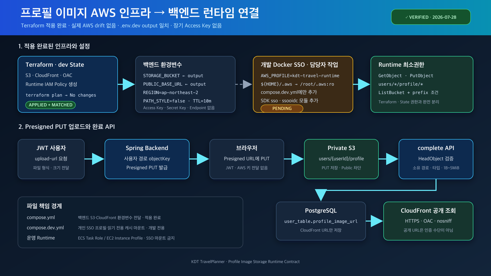

# 프로필 이미지 AWS 인프라와 백엔드 런타임 연결



## 현재 상태

2026-07-28 기준 dev 프로필 이미지 인프라를 Terraform으로 적용했고 실제 AWS refresh 결과가 `No changes`다.

- 비공개 S3 버킷과 Public Access Block, `BucketOwnerEnforced`, AES-256 암호화, Versioning, 제한된 CORS가 적용됐다.
- CloudFront OAC, Distribution과 `X-Content-Type-Options: nosniff` 응답 정책이 적용됐다.
- CloudFront만 지정된 Distribution ARN 조건으로 `users/*/profile/*` 원본을 읽는다.
- 백엔드 Runtime IAM Policy는 생성됐지만 자동 연결되지 않는다.
- 로컬 `.env.dev`의 버킷 이름과 CloudFront 기본 URL이 Terraform output과 일치한다.
- `.env.dev`에는 애플리케이션 전용 Access Key와 Secret Key가 없다.
- 공통 `compose.yml`은 프로필 이미지 환경변수를 백엔드 컨테이너로 전달한다.
- 개발용 SSO 프로필 전달, AWS SDK SSO 모듈과 `~/.aws` 마운트는 다른 담당자의 남은 범위다.

계정 ID, 실제 버킷 이름, CloudFront Distribution 도메인과 State 내용은 이 문서에 기록하지 않는다.

## Terraform output과 애플리케이션 설정

`infra/environments/dev`에서 다음 output을 확인한다.

```bash
AWS_PROFILE=kdt-travel-terraform \
  terraform output -raw profile_image_bucket_name

AWS_PROFILE=kdt-travel-terraform \
  terraform output -raw profile_image_public_base_url

AWS_PROFILE=kdt-travel-terraform \
  terraform output -raw profile_image_runtime_policy_arn
```

| Terraform output | 백엔드 환경변수·용도 |
|---|---|
| `profile_image_bucket_name` | `PROFILE_IMAGE_STORAGE_BUCKET` |
| `profile_image_public_base_url` | `PROFILE_IMAGE_PUBLIC_BASE_URL` |
| `profile_image_runtime_policy_arn` | Runtime Role 또는 Permission Set에 연결할 최소권한 정책 |

dev example은 실제 식별자 대신 다음 placeholder를 사용한다.

```dotenv
AWS_PROFILE=kdt-travel-runtime
PROFILE_IMAGE_STORAGE_ENABLED=true
PROFILE_IMAGE_STORAGE_REGION=ap-northeast-2
PROFILE_IMAGE_STORAGE_BUCKET=kdt-travelplanner-dev-profile-images-<AWS_ACCOUNT_ID>
PROFILE_IMAGE_PUBLIC_BASE_URL=https://<CLOUDFRONT_DISTRIBUTION_DOMAIN>
PROFILE_IMAGE_STORAGE_PATH_STYLE_ACCESS_ENABLED=false
PROFILE_IMAGE_UPLOAD_URL_TTL=10m
```

AWS S3를 사용할 때 endpoint override는 설정하지 않는다. `PROFILE_IMAGE_STORAGE_ACCESS_KEY`, `PROFILE_IMAGE_STORAGE_SECRET_KEY`도 두지 않는다. 백엔드의 `DefaultCredentialsProvider`가 개발에서는 SSO 프로필, 운영에서는 ECS Task Role 또는 EC2 Instance Profile을 사용한다.

## Runtime 최소권한

`KDT-Dev-Runtime-Test`가 사용하는 정책은 다음 범위여야 한다.

```json
{
  "Version": "2012-10-17",
  "Statement": [
    {
      "Sid": "ProfileImageObjects",
      "Effect": "Allow",
      "Action": [
        "s3:GetObject",
        "s3:PutObject"
      ],
      "Resource": "arn:aws:s3:::PROFILE_IMAGE_BUCKET/users/*/profile/*"
    },
    {
      "Sid": "ProfileImageLookup",
      "Effect": "Allow",
      "Action": "s3:ListBucket",
      "Resource": "arn:aws:s3:::PROFILE_IMAGE_BUCKET",
      "Condition": {
        "StringLike": {
          "s3:prefix": "users/*/profile/*"
        }
      }
    }
  ]
}
```

- `s3:PutObject`: 백엔드가 서명한 Presigned PUT의 업로드 권한
- `s3:GetObject`: 완료 API의 `HeadObject` 검증 권한
- `s3:ListBucket`: 동일 prefix에서 없는 객체를 404로 구분하기 위한 권한

Terraform이 만든 고객 관리형 Runtime Policy와 동일한 인라인 정책 중 하나만 `KDT-Dev-Runtime-Test`에 사용한다. 둘을 동시에 연결하지 않는다. Identity Center가 만든 `AWSReservedSSO_...` Role을 IAM 콘솔에서 직접 수정하지 않는다.

## Compose 파일별 책임

공통 `compose.yml`은 애플리케이션 설정만 전달한다.

```yaml
services:
  backend:
    environment:
      PROFILE_IMAGE_STORAGE_ENABLED: ${PROFILE_IMAGE_STORAGE_ENABLED:-false}
      PROFILE_IMAGE_STORAGE_REGION: ${PROFILE_IMAGE_STORAGE_REGION:-ap-northeast-2}
      PROFILE_IMAGE_STORAGE_BUCKET: ${PROFILE_IMAGE_STORAGE_BUCKET:-}
      PROFILE_IMAGE_PUBLIC_BASE_URL: ${PROFILE_IMAGE_PUBLIC_BASE_URL:-}
      PROFILE_IMAGE_STORAGE_PATH_STYLE_ACCESS_ENABLED: ${PROFILE_IMAGE_STORAGE_PATH_STYLE_ACCESS_ENABLED:-false}
      PROFILE_IMAGE_UPLOAD_URL_TTL: ${PROFILE_IMAGE_UPLOAD_URL_TTL:-10m}
```

호스트 개인 자격증명은 개발 전용 `compose.dev.yml`에서만 공유해야 한다. 현재 dev target은 root로 실행되므로 `/root/.aws`가 맞다.

```yaml
services:
  backend:
    environment:
      AWS_PROFILE: ${AWS_PROFILE:-kdt-travel-runtime}
      AWS_REGION: ${PROFILE_IMAGE_STORAGE_REGION:-ap-northeast-2}
      AWS_DEFAULT_REGION: ${PROFILE_IMAGE_STORAGE_REGION:-ap-northeast-2}
    volumes:
      - ${HOME}/.aws:/root/.aws:ro
```

이 dev override를 base `compose.yml`이나 운영 구성에 넣지 않는다. 운영 컨테이너는 사람의 SSO 캐시 대신 Runtime Role을 사용한다.

현재 백엔드는 AWS SDK `s3` 모듈만 포함한다. SSO 프로필을 Java SDK에서 사용하려면 마운트 담당 변경에 다음 모듈도 포함되어야 한다.

```kotlin
implementation("software.amazon.awssdk:sso")
implementation("software.amazon.awssdk:ssooidc")
```

## 업로드와 DB 반영 흐름

```text
JWT 사용자
  → POST /api/v1/users/me/profile-image/upload-url
  → 백엔드가 사용자 경로의 Presigned PUT URL 발급
  → 브라우저가 Presigned URL로 S3에 PUT
  → POST /api/v1/users/me/profile-image/complete + objectKey
  → 백엔드가 S3 HeadObject로 소유 경로·형식·Content-Type·크기 검증
  → CloudFront base URL + objectKey 생성
  → user_table.profile_image_url 저장
```

DB에는 버킷 이름이나 CloudFront 설정을 별도로 저장하지 않는다. 완료 API가 최종 공개 URL만 사용자 프로필에 저장한다.

## 개발 실행과 검증

호스트에서 먼저 로그인한다.

```bash
aws sso login --profile kdt-travel-runtime
aws sts get-caller-identity --profile kdt-travel-runtime
```

SSO 마운트와 SDK 모듈 변경이 완료된 뒤 실행한다.

```bash
docker compose --env-file .env.dev \
  -f compose.yml \
  -f compose.dev.yml \
  up --build backend
```

검증 순서:

1. 컨테이너에 `AWS_PROFILE=kdt-travel-runtime`이 전달됐는지 확인한다.
2. `/root/.aws/config`와 `/root/.aws/sso/cache`가 읽기 전용으로 보이는지 확인한다.
3. 업로드 URL API가 502 대신 Presigned URL과 `objectKey`를 반환하는지 확인한다.
4. 동일한 `Content-Type`, 파일 크기로 Presigned URL에 PUT한다.
5. 완료 API가 CloudFront URL을 반환하고 DB 프로필 URL이 변경되는지 확인한다.
6. 반환된 CloudFront URL이 HTTPS로 이미지를 제공하는지 확인한다.

## 장애 확인 순서

| 증상 | 우선 확인 |
|---|---|
| `Unable to load credentials` | `AWS_PROFILE`, `/root/.aws` 마운트, SDK `sso`·`ssooidc` 모듈 |
| `ExpiredToken` 또는 SSO 만료 | 호스트에서 `aws sso login --profile kdt-travel-runtime` 재실행 |
| 업로드 URL API 502 | Runtime Permission Set, 버킷·Region 환경변수 |
| 완료 API 404 | PUT 성공 여부와 전달한 `objectKey` |
| 완료 API 400 | Content-Type, 확장자, 1 byte~5 MiB 크기 |
| CloudFront 403 | OAC Bucket Policy와 객체 key가 `users/*/profile/*`인지 확인 |

## 보안 경계

- `.env.dev`, `~/.aws`, SSO cache와 Terraform State를 Git에 커밋하지 않는다.
- Profile Image Runtime에 Terraform, State 버킷 또는 다른 S3 경로 권한을 주지 않는다.
- Terraform Operator 자격증명을 백엔드 컨테이너에 전달하지 않는다.
- CloudFront 공개 URL과 UUID key는 인증 수단이 아니다. 프로필 이미지는 공개 정보로 취급한다.
- 운영에서는 SSO 마운트와 장기 Access Key를 사용하지 않는다.

## 관련 문서

- [Terraform 인프라 실행 가이드](../../infra/README.md)
- [dev 환경변수 example](../../.env.dev.example)
- [공통 Compose](../../compose.yml)
